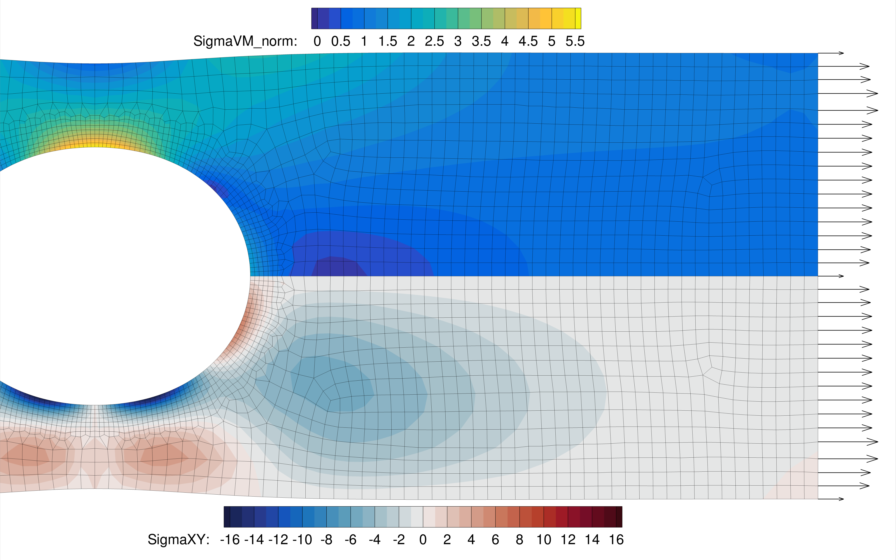
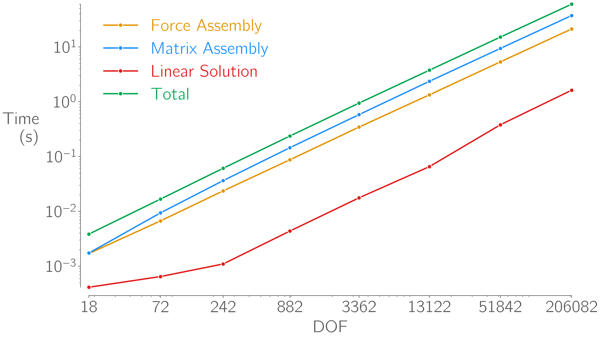

# FEMpy

[](https://A-CGray.github.io/FEMpy/)
[](https://A-CGray.github.io/FEMpy/)
[](https://A-CGray.github.io/FEMpy/)
[](https://github.com/psf/black)
[](https://codeclimate.com/github/A-CGray/FEMpy/test_coverage)
[](https://codeclimate.com/github/A-CGray/FEMpy/maintainability)

FEMpy is my attempt to implement a basic object-oriented finite element method in python.



FEMpy uses scipy's sparse matrix implementation to enable scaling to problems with many (>100k) degrees of freedom.
Wherever possible, operations use numpy vectorisation or numba JIT compiling for speed, there's still plenty of room for improvement though!



## How to install
Inside the FEMpy root directory run:
```shell
pip install .
```
Or, if you want to make changes to the code:
```shell
pip install -e .
```
If you want to build documentation locally, or run the unit tests, make sure to install the necessary dependencies:
```shell
pip install -e .[all]
```
And then run:
```shell
make build
```

## Documentation
View the documentation (still under construction) [here](https://A-Gray-94.github.io/FEMpy/)
