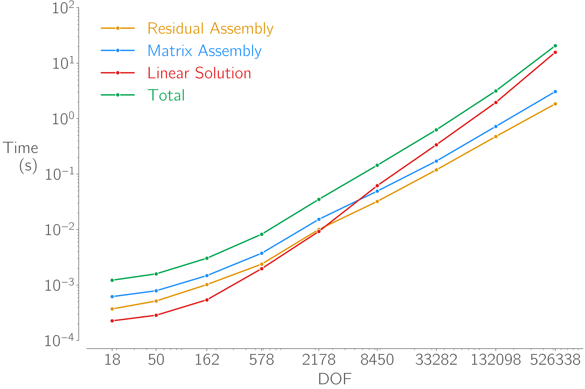

# FEMpy

FEMpy is my attempt to implement a basic object-oriented finite element method in python that's as fast and flexible as possible.


FEMpy uses Numba JIT compilation extensively to perform fast, multithread operations over many elements at once.
It uses scipy's sparse matrix implementation and can use the super-fast [Paradiso solver](https://github.com/haasad/PyPardisoProject) from Intel's MKL to assemble and solve problems with 500,000 degrees of freedom in a few seconds.



## How to install
Inside the FEMpy root directory run:
```shell
pip install .
```
Or, if you want to make changes to the code:
```shell
pip install -e .
```

To run unit tests.
```shell
testflo -n 1 -v .
```
